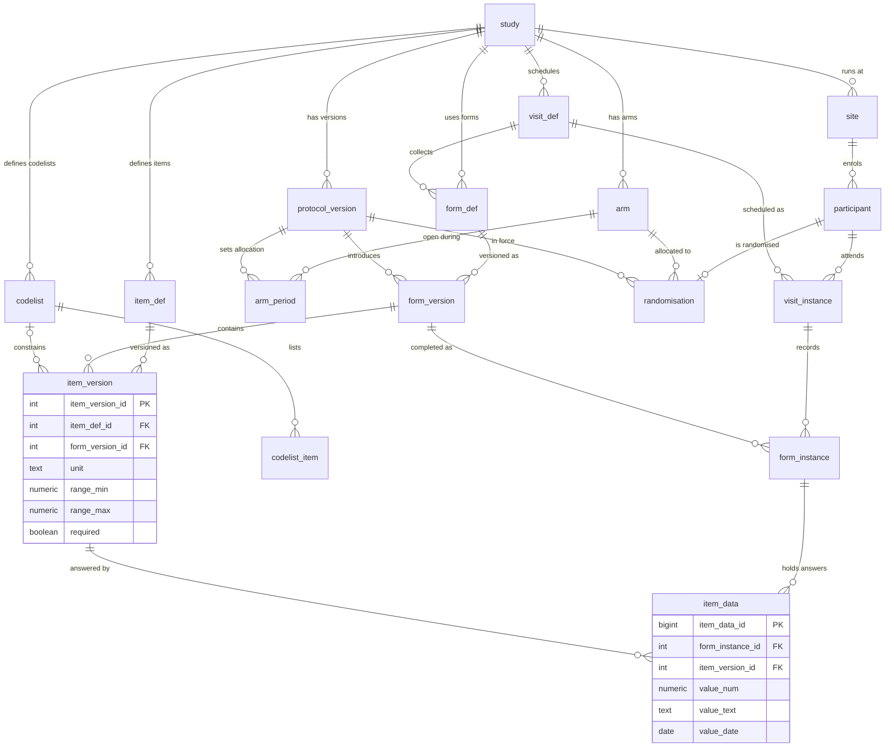

# Entity-relationship diagram

Top half: the protocol stored as data (metadata). Bottom half: patient data.
A protocol modification adds rows to the metadata tables; no table changes shape.

```mermaid
erDiagram
    study ||--o{ protocol_version : "has versions"
    study ||--o{ arm : "has arms"
    study ||--o{ visit_def : "schedules"
    study ||--o{ form_def : "uses forms"
    study ||--o{ item_def : "defines items"
    study ||--o{ codelist : "defines codelists"
    study ||--o{ site : "runs at"
    arm ||--o{ arm_period : "open during"
    protocol_version ||--o{ arm_period : "sets allocation"
    visit_def ||--o{ form_def : "collects"
    form_def ||--o{ form_version : "versioned as"
    protocol_version ||--o{ form_version : "introduces"
    item_def ||--o{ item_version : "versioned as"
    form_version ||--o{ item_version : "contains"
    codelist ||--o{ codelist_item : "lists"
    codelist |o--o{ item_version : "constrains"
    site ||--o{ participant : "enrols"
    participant ||--o| randomisation : "is randomised"
    arm ||--o{ randomisation : "allocated to"
    protocol_version ||--o{ randomisation : "in force"
    participant ||--o{ visit_instance : "attends"
    visit_def ||--o{ visit_instance : "scheduled as"
    visit_instance ||--o{ form_instance : "records"
    form_version ||--o{ form_instance : "completed as"
    form_instance ||--o{ item_data : "holds answers"
    item_version ||--o{ item_data : "answered by"

    item_data {
        bigint item_data_id PK
        int form_instance_id FK
        int item_version_id FK
        numeric value_num
        text value_text
        date value_date
    }
    item_version {
        int item_version_id PK
        int item_def_id FK
        int form_version_id FK
        text unit
        numeric range_min
        numeric range_max
        boolean required
    }
```
